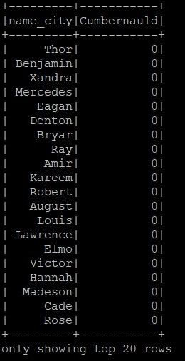
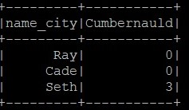
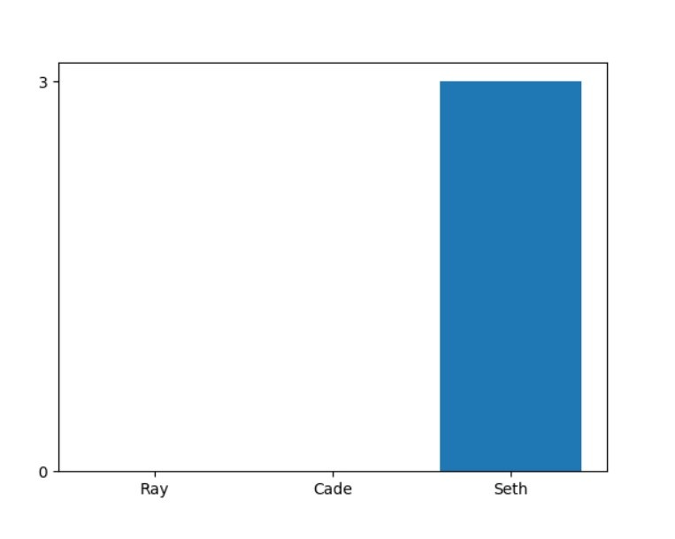

# ase2019-kokodzambo-and-forward
ase2019-kokodzambo-and-forward created by GitHub Classroom

Authors:
Bartosz Bieliński,
Piotr Winkler

In order to run the project firstly create .csv file from provided "data_gr_A.json" file. To do this run script "load_data_to_csv.py". If default Amazon S3 buckets are termianted you need to create your own bucket, upload CSV file to it and adjust paths to data.
Then run EMR PySpark cluster using AWS and connect with it by putty. In hadoop console type "pyspark" in order to enter pyspark console. After that rewrite to the console all commands from "project.py" script in given order. Some variables like place or names can be modified in order to get different results. 

First query will give you number of people having the same name and working in the same city in the same company.

Second query will give you statistics representing the occurrence of certain names in a given location. 

These operations will save results of two queries in S3 bucket indicated by the user. Results of the second query can be plotted. To do that load .csv files with query results from your bucket and save them on your machine. To see the bar plot based on provided data indicate their directory in "plot.py" script and launch it.  

For more reliable results of queries, you may want to use data in "extended_data.csv".

Whole process step by step:

* Firstly, data is decoded from JSON using enconding "utf-8". Decoded data is then loaded to pandas DataFrame and saved as CSV file. Decoding and converting to CSV takes place in "load_data_to_csv.py".

* Data in CSV need to be uploaded to Amazon S3 bucket before using PySpark.

* To run first query you need to create RDD (Resilient Distributed Datasets) from CSV file in S3 bucket, (lines are splitted with ",")
  
  RDD is a collection of read-only data distributed in the cluster of machines that is kept in error-proof manner. RDD are immutable and they are using "lazy evaluating". RDD is a base of Spark. More information about RDD and RDD functions can be found in documentary linked below.


    
* Then you need to remove first row from RDD as it contains the header

* Then you need to create DataFrame from received RDD.

    DataFrame is next core component in Spark. DF is a Dataset (distributed collection data) organized into named columns, DataFrames resemble tables in a relational database. DF allows us to make SQL queries on our data and allows us to read data in many formats like JSON, Hive table or Parquet which makes DF really universal. Thats why we have decided to use them.
More information about DF and DF functions can be found in documentary linked below.

  First 20 rows of data in DF:
  
  

* First query is counting people having the same name and working in the same city in the same company, this query is realised with: 

```
  query1 = df1.groupBy(df1.company, df1.city, df1.name).count().where(f.col('count') > 1)
```

  This query is based on "GROUP BY" statement, that is grouping rows that have the same values into summary rows, It is grouping rows by "company", "city" and "name" Received rows are then counted, if there is more than 1 row received from statement, that means, that we found people having the same name and working in the same city in the same company. This case can be then show using:
  
```
  query1.show()
```
  
 Results of the first query can be saved for further processing in S3 bucket with:
 
 ```
    query1.select("company", "city", "name", "count").write.save(task1_path, format="csv")
 ```

Exemplary results:


* Second will give you statistics representing the occurrence of certain names in a given location:

**place** variable contains the name of the place where we would like to check the presence of given people. For example:
```
  place = 'Cumbernauld'
```

  ```
  df2 = df1.crosstab('name', 'city').select('name_city', place)
  ```
This query makes a grid of elements, saved in first data frame, using **crosstab** function. The first column contains all names of people and the first raw contains the name of city given in **place** variable. Second column contains numbers indicating how many people with given name lives in given city. Details of **crosstab** function can be found in DF documentary linked below.



List called **names** contains the names of people we would like to find in previously given location. For example:
```
  names = ['Ray', 'Cade', 'Seth']
```
  ```
  df2.filter(df2.name_city.rlike('|'.join(names))).write.save(task2_path, format="csv")
  ```
  
This query checks the presence of names from "name_city" column of second data frame on the "names" list using **rlike** function. All names from mentioned list are connected by **join** function. If the name from "name_city" is on the list whole record from **df2** connected with this name is saved in indicated S3 bucket. Details of **rlike** function can be found in DF documentary linked below.



After downloading data from S3 we can plot the results using **plot.py** script. The example chart may look as follows.




Bibliography:
* Pyspark RDD - https://spark.apache.org/docs/1.1.1/api/python/pyspark.rdd.RDD-class.html
* PySpark DF - https://spark.apache.org/docs/2.1.0/api/python/pyspark.sql.html

References:

[1] Amazon EC2. http://aws.amazon.com/ec2.

[2] Apache Hadoop. http://hadoop.apache.org.

[3] Apache Hive. http://hadoop.apache.org/hive.

[4] Applications powered by Hadoop.
http://wiki.apache.org/hadoop/PoweredBy.

[5] Scala. http://www.scala-lang.org.

[6] R. Bose and J. Frew. Lineage retrieval for scientific data
processing: a survey. ACM Computing Surveys, 37:1–28,
2005.

[7] S. Brin and L. Page. The anatomy of a large-scale
hypertextual web search engine. In WWW, 1998.

[8] Y. Bu, B. Howe, M. Balazinska, and M. D. Ernst.
HaLoop: efficient iterative data processing on large
clusters. Proc. VLDB Endow., 3:285–296, September
2010.

[9] C. Chambers, A. Raniwala, F. Perry, S. Adams, R. R.
Henry, R. Bradshaw, and N. Weizenbaum. Flumejava:
easy, efficient data-parallel pipelines. In Proceedings of
the 2010 ACM SIGPLAN conference on Programming
language design and implementation, PLDI ’10. ACM,
2010.

[10] J. Cheney, L. Chiticariu, and W.-C. Tan. Provenance in
databases: Why, how, and where. Foundations and
Trends in Databases, 1(4):379–474, 2009.

[11] C. T. Chu, S. K. Kim, Y. A. Lin, Y. Yu, G. R. Bradski,
A. Y. Ng, and K. Olukotun. Map-reduce for machine
learning on multicore. In NIPS ’06, pages 281–288. MIT
Press, 2006.
14

[12] J. Dean and S. Ghemawat. MapReduce: Simplified data
processing on large clusters. In OSDI, 2004.

[13] J. Ekanayake, H. Li, B. Zhang, T. Gunarathne, S.-H.
Bae, J. Qiu, and G. Fox. Twister: a runtime for iterative
mapreduce. In HPDC ’10, 2010.

[14] P. K. Gunda, L. Ravindranath, C. A. Thekkath, Y. Yu,
and L. Zhuang. Nectar: automatic management of data
and computation in datacenters. In OSDI ’10, 2010.

[15] T. Hastie, R. Tibshirani, and J. Friedman. The Elements
of Statistical Learning: Data Mining, Inference, and
Prediction. Springer Publishing Company, New York,
NY, 2009.

[16] U. Hoelzle and L. A. Barroso. The Datacenter as a
Computer: An Introduction to the Design of
Warehouse-Scale Machines. Morgan and Claypool
Publishers, 1st edition, 2009.

[17] Mobile Millennium Project.
http://traffic.berkeley.edu.
[18] M. Isard, M. Budiu, Y. Yu, A. Birrell, and D. Fetterly.
Dryad: distributed data-parallel programs from
sequential building blocks. In EuroSys 07, 2007.

[19] A.-M. Kermarrec, G. Cabillic, A. Gefflaut, C. Morin, and
I. Puaut. A recoverable distributed shared memory
integrating coherence and recoverability. In FTCS ’95,
1995.

[20] S. Y. Ko, I. Hoque, B. Cho, and I. Gupta. On availability
of intermediate data in cloud computations. In HotOS
’09, 2009.

[21] G. Malewicz, M. H. Austern, A. J. Bik, J. C. Dehnert,
I. Horn, N. Leiser, and G. Czajkowski. Pregel: a system
for large-scale graph processing. In SIGMOD, pages
135–146, 2010.

[22] S. Melnik, A. Gubarev, J. J. Long, G. Romer,
S. Shivakumar, M. Tolton, and T. Vassilakis. Dremel:
interactive analysis of web-scale datasets. Proc. VLDB
Endow., 3:330–339, Sept 2010.

[23] D. G. Murray, M. Schwarzkopf, C. Smowton, S. Smith,
A. Madhavapeddy, and S. Hand. Ciel: a universal
execution engine for distributed data-flow computing. In
NSDI, 2011.

[24] B. Nitzberg and V. Lo. Distributed shared memory: a
survey of issues and algorithms. Computer, 24(8):52
–60, aug 1991.

[25] C. Olston, B. Reed, U. Srivastava, R. Kumar, and
A. Tomkins. Pig latin: a not-so-foreign language for data
processing. In SIGMOD ’08, pages 1099–1110.
